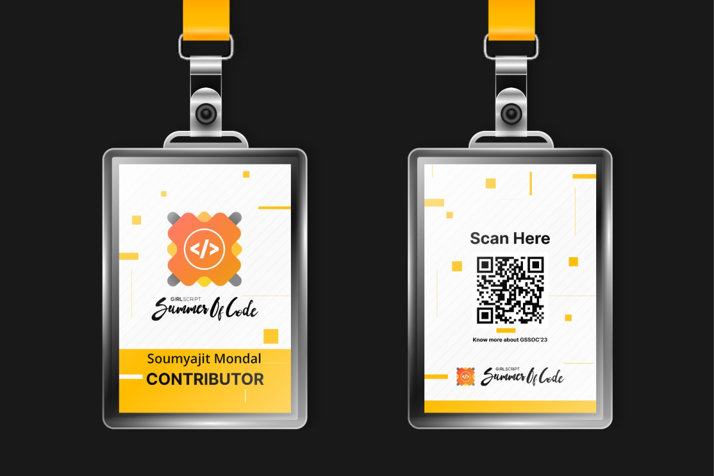
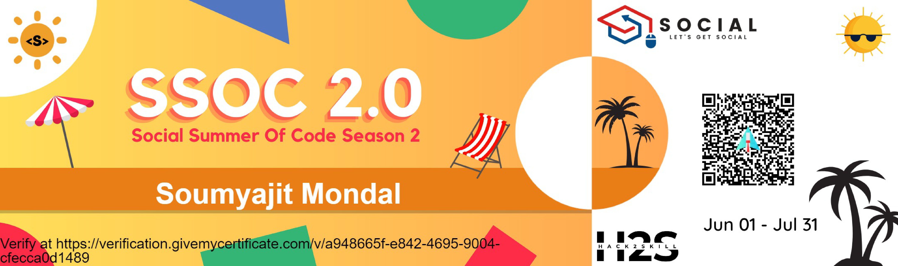
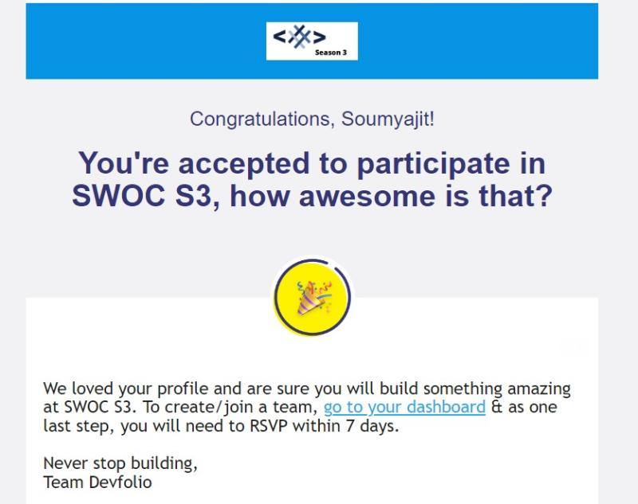
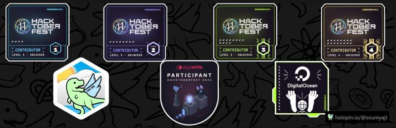
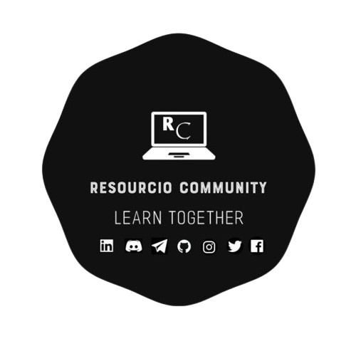
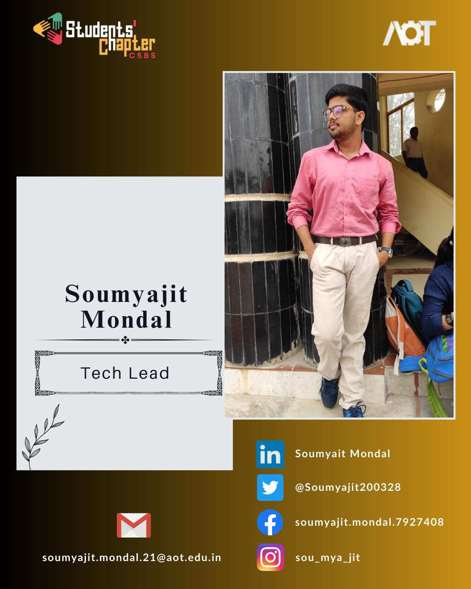

<!-- Internship Works -->
## Oasis Infobyte
- *Web Development & Designing Intern* | May'23 - June'23
- 
- Tags: Internship Work
- Badges:
  - Internship [blue]
  - Web Development [red]
  - Designing [yellow]
- List Items:
  - Completed 3 web development tasks - i> Landing Page ii> Portfolio Website iii> Temperature Converter
  - It helped me to gather deep knowledge in HTML, CSS and JavaScript and also helped me to improve my frontend development skills.

## Suvidha Foundation (Suvidha Mahila Mandal)
- *Web Developement Intern* | Dec'22 - Jan'23
- 
- Tags: Internship Work
- Badges:
  - Internship [blue]
  - Web Development [red]
- List Items:
  - Developed the home-page of Suvidha Foundation by working as a team during the internship.
  - Helped me to gain a lot of experience and to improve my frontend development skills.

<!-- Open Source Contributions -->
## Girlscript Summer of Code
- *Contributor* | May'23 - Present
- 
- Tags: Open Source
- Badges:
  - Open Source [blue]
  - Git [red]
  - GitHub [yellow]
  - GSSOC [green]
- List Items:
  - GirlScript Summer of Code is the 3 month long Open Source program during summers conducted by GirlScript Foundation, started in 2018, with an aim to help beginners get started with Open Source Development while encouraging diversity.Throughout the program, participants contribute to different projects under guidance of experienced mentors. Top participants get exciting goodies and opportunities.

## Social Summer of Code
- *Contributor* | May'23 - Present
- 
- Tags: Open Source
- Badges:
  - Open Source [blue]
  - Git [red]
  - GitHub [yellow]
  - SSOC [green]
- List Items:
  - SSOC is a 2 Month Open Source Program Organized By Social. We aim to promote open source with new age technologies & want everyone to get the right path & gudience through SSOC

## Social Winter of Code
- *Contributor* | Dec'22 - Mar'23
- 
- Tags: Open Source
- Badges:
  - Open Source [blue]
  - Git [red]
  - GitHub [yellow]
  - SWOC [green]
- List Items:
  - Social Winter of Code is an open-source program envisioned by the Social. It aims to bring students into the world of open source development and see the power of unified problem-solving in real time.
  - This 3 months long open source program helped me a lot to develop my open source contribution skills.

## Hacktoberfest
- *Contributor* | Oct'22 - Nov'22
- 
- Tags: Open Source
- Badges:
  - Open Source [blue]
  - Git [red]
  - GitHub [yellow]
  - Hacktoberfest [green]
- List Items:
  - Hacktoberfest is an online festival for the open-source community that is organized by Digital Ocean, an American cloud services infrastructure provider that has data centers across the globe. Hactoberfest is put into effect by Digital Ocean and is solely controlled by GitHub.
  - It was my first open source contribution. I had gathered a lot of knowledge about git,github,open source contributing,doing pull and merge requests,working on issues,maintaining repositories and much more

<!-- Volunteering -->

## Resourcio Community 
- *Founder & Lead* | Dec'22 - Present
- 
- Tags: Volunteering
- Badges:
  - Community [blue]
  - Founder [red]
  - Lead [yellow]
  - Resourcio Community [green]
- List Items:
  - Resourcio Community is an open source community which is made for all engineers. It's a one stop hub for all engineers.Through Resourcio we have tried to bring in different resources related to software development and other different fields related to software enginnering in a single place. We want to provide students a single platform where they can find all new resources and they dont need to browse the web extensively for learning them.
  - We host weekly interactive sessions, weekly quiz events and many more interactive events to make the community bigger and to help all the members.

## IEI STUDENT'S CHAPTER CSBS - Academy Of Technology
- *Tech Lead* | Mar'23 - Present
- 
- Tags: Volunteering
- Badges:
  - Student Chapter [blue]
  - Tech Lead [red]
  - Management [yellow]
- List Items:
  - Introducing The Student Chapter CSBS of Academy OF Technology
  - Student's Chapter CSBS is more than just a group of individuals - we are a tightly-knit community that fosters trust, creativity, and open communication. As Helen Keller once said, 'Alone we can do so little; together we can do so much.' 